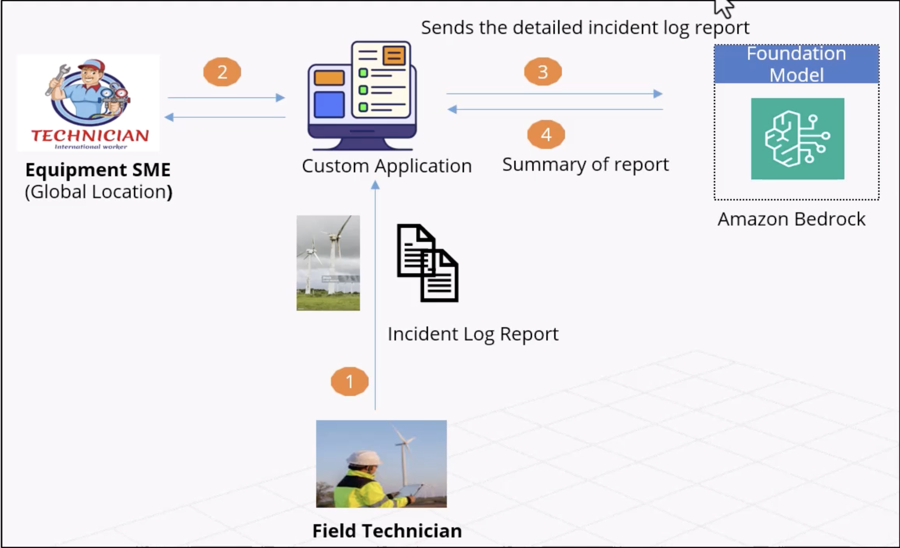
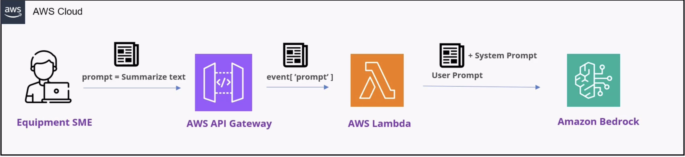

# Use Case 1: GenAI-Powered Equipment SME Assistant

## Business Use Case

A large manufacturing organization operating wind turbines aims to implement a **GenAI-Powered Equipment SME (Subject Matter Expert) Assistant** to support maintenance engineers, field technicians, and equipment experts. The solution leverages Generative AI to provide instant access to equipment knowledge, troubleshooting guidance, maintenance procedures, and historical operational insights, helping reduce turbine downtime and improve operational efficiency.

---

# Business Drivers

## 1. Reduce Wind Turbine Downtime
- Enable faster diagnosis of equipment failures.
- Provide real-time troubleshooting recommendations.
- Minimize Mean Time to Repair (MTTR).
- Improve turbine availability and power generation output.

## 2. Improve Productivity of Equipment SMEs
- Reduce time spent searching manuals and documentation.
- Automate knowledge retrieval from multiple systems.
- Allow SMEs to focus on high-value engineering activities.
- Scale expert knowledge across global maintenance teams.

## 3. Preserve Organizational Knowledge
- Capture knowledge from experienced engineers.
- Prevent knowledge loss due to employee turnover.
- Create a centralized knowledge repository.

## 4. Improve Maintenance Efficiency
- Standardize troubleshooting processes.
- Reduce repeat failures through better root cause analysis.
- Support predictive and preventive maintenance strategies.

---

# Solution Overview

The GenAI Equipment SME Assistant acts as an intelligent engineering copilot that can answer technical questions, analyze equipment issues, and provide actionable recommendations by combining:

- Equipment manuals
- Maintenance procedures
- Historical maintenance records
- Sensor and SCADA data
- Incident reports
- Engineering drawings
- Manufacturer documentation
- SME knowledge base

The assistant uses Retrieval-Augmented Generation (RAG) and Large Language Models (LLMs) to deliver accurate, context-aware responses.

---

# Equipment SME Assistant Project Flow

 


## Step 1: Data Collection

Collect information from multiple enterprise sources:

- Equipment manuals
- Standard Operating Procedures (SOPs)
- Maintenance work orders
- Historical failure reports
- SCADA sensor data
- ERP systems
- Asset Management Systems
- Engineering documents

### Output
Unified equipment knowledge repository.

---

## Step 2: Data Processing & Knowledge Indexing

- Document ingestion
- Metadata extraction
- Data cleansing
- Embedding generation
- Vector database indexing

### Output
Searchable engineering knowledge base.

---

## Step 3: GenAI Knowledge Retrieval

User submits a question:

> "Why is Wind Turbine WT-102 showing gearbox temperature alarms?"

System performs:

- Semantic search
- Context retrieval
- Relevant document identification
- Historical incident matching

### Output
Relevant technical context.

---

## Step 4: LLM Analysis

The Large Language Model analyzes:

- Equipment history
- Maintenance records
- Failure patterns
- Technical documentation

### Output
AI-generated diagnostic recommendations.

---

## Step 5: Expert Guidance Generation

The assistant provides:

- Root cause hypotheses
- Troubleshooting steps
- Recommended inspections
- Safety procedures
- Relevant documentation references

### Output
Actionable maintenance guidance.

---

## Step 6: Continuous Learning

- Capture user feedback
- Store resolved incidents
- Update knowledge repository
- Improve response quality

### Output
Continuous model improvement.

---

# Key Features

## Intelligent Q&A
Ask natural language questions regarding equipment operation and maintenance.

### Example
> What are the common causes of gearbox overheating in turbine model X?

---

## Root Cause Analysis Assistance

Provides likely causes based on:

- Historical failures
- Sensor trends
- Engineering documentation

---

## Maintenance Procedure Guidance

Generates step-by-step maintenance instructions.

### Example
> Show gearbox inspection procedure.

---

## Incident Resolution Recommendations

Suggests corrective actions based on similar historical cases.

---

## Knowledge Search

Semantic search across:

- Manuals
- SOPs
- Maintenance records
- Engineering reports

---

## Predictive Maintenance Insights

Identifies patterns indicating potential future failures.


# High-Level Architecture

```text
Data Sources
     │
     ▼
Document Ingestion Layer
     │
     ▼
Data Processing & Embedding
     │
     ▼
Vector Database
     │
     ▼
Retrieval Layer (RAG)
     │
     ▼
Foundation Model (Amazon Bedrock)
     │
     ▼
Equipment SME Assistant
     │
     ▼
Engineers / Technicians / SMEs

# Solution Architecture for the Use Case – POC to Production

## Architecture Components

### 1. AWS GenAI Service
- **Amazon Bedrock**
- Managed service for accessing foundation models and building GenAI applications.

### 2. Foundation Model
- **Amazon Nova Pro**
- Used for intelligent question answering, reasoning, troubleshooting, and content generation.

### 3. Compute Layer
- **AWS Lambda**
- Serverless compute service for orchestrating workflows, processing requests, and integrating backend systems.

### 4. API Layer
- **AWS API Gateway**
- Secure API endpoint for communication between users, applications, and the GenAI backend.

---

## Solution Architecture Diagram

---

## High-Level Request Flow

```text
User / Engineer
       │
       ▼
AWS API Gateway
       │
       ▼
AWS Lambda
       │
       ▼
Amazon Bedrock
       │
       ▼
Amazon Nova Pro
       │
       ▼
Generated Response
       │
       ▼
User / Engineer
```



## Key Benefits

- Scalable serverless architecture
- Secure API-based integration
- Reduced operational overhead
- Faster deployment from POC to Production
- Seamless access to foundation models through Amazon Bedrock
- High availability and reliability